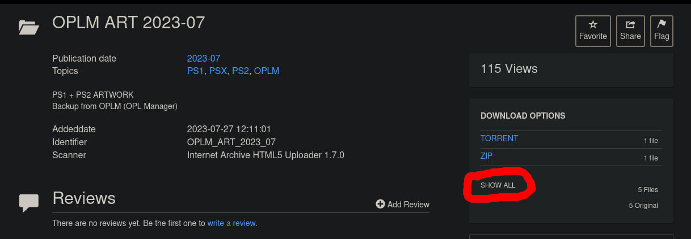
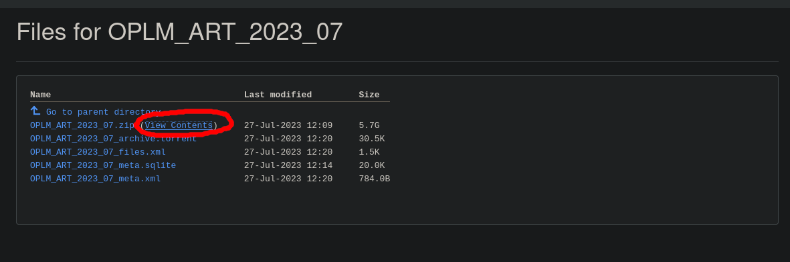
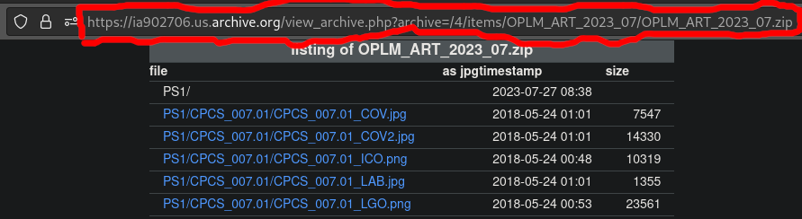

# PyOPLM - Python Open PS2 Loader Manager
PyOPLM is a simple, Linux-only, WIP python app to manage games installed in a directory used by [Open PS2 Loader](https://github.com/Jay-Jay-OPL/OPL-Daily-Builds). Supports SMB and USB folders at the moment, hard drive games support is WIP.

## Features
 - Add, remove and rename games in your OPL Directory
   - Support for ISO games, UL and POPS games (POPS and PS2 CD bin/cue game install support is only on x86_64 linux)
 - Read, write and fix ul.cfg
 - List all games on n OPL directory
 - init OPL Directory with all needed folders
 - Fix game names for all games on drive
 - Update game titles and download game art from an online static file storage or local directory
 - Comes packaged with [bchunk](https://github.com/extramaster/bchunk), [binmerge](https://github.com/putnam/binmerge) and [cue2pops-linux](https://github.com/tallero/cue2pops-linux) for x86_64 Linux, their respective licenses can be found in their folders in the pyoplm/lib/linux64 folder of this repo

## Installation
```bash
pip install pyoplm
```

Latest version is 0.5

## TODO
 - CFG file editor, download game data from an open api like RAWG.io


## Artwork and title database

Due to this being an open source project, a bit of "self hosting" is required to get these features that require storage to work

In order to have support for artwork downloading and game title fetching, you need to either download one of danielb's [OPLM monthly art database backups](https://oplmanager.com/site/?backups) (i tested this program on [OPLM_ART_2023_07.zip](https://archive.org/download/OPLM_ART_2023_07/OPLM_ART_2023_07.zip)) on your system or host the contents of a ZIP backup in a static file storage server (like Google cloud storage buckets, i like using Google cloud because of te free trails but you can place the files anywhere), and give this program the location where the backup is unzipped, and then you can download artwork and update titles for any installed game on your drive.

In order to be able to use storage features, you need to create a file named `pyoplm.ini` in your OPL directory, and insert your storage URL in there  just like in the file `example.pyoplm.ini` in the root of this repo.

### Indexing the zip backups

This program supports indexing for the zip files, which is a much faster way of downloading art and titles from online storages (for local storages too, but it doesn't make too much of a difference in speed). This is necessary because the types of art a game has on an online storage can only be found out through guessing without the data being indexed, which leads to the non-indexed usage of the storage features being much slower.

Perform these steps to enable indexing:

1. Go to the page of the Archive.org danielb backup you want to use (i'm using the August 2023 backup) and select the `show all` button in the download options. 
2. Click the `(view content)` button next to the zip file in the list that appears 
3. Copy the link of the page where you will be redirected to after clicking 
4. Paste this link to the `zip_contents_location` key of the `[STORAGE.INDEXING]` section of the `pyoplm.ini` file in your OPL drive
    ```ini
    [STORAGE.INDEXING]
    # URL to the internet archive "(View Contents)" results for the zip backup
    # Placeholder is the archive to the august 2023 backup
    zip_contents_location=https://ia802706.us.archive.org/view_archive.php?archive=/4/items/OPLM_ART_2023_07/OPLM_ART_2023_07.zip
    ```
5. After running pyoplm, the indexing process will be performed and the results will be stored in the `indexed_storage.db` file in your OPL game directory. This process takes a bit of time but only needs to be performed once
6. Enjoy 2x+ faster online storage artwork and title download times :)

## Usage

The argument opl_dir is mostly required to be supplid by the commands of this app, but can be avoided by putting your
OPL Directory in an environment variable named PYOPLM_OPL_DIR 

```
$ pyoplm --help
usage: pyoplm [-h] {list,add,storage,rename,fix,init,delete} ...

positional arguments:
  {list,add,storage,rename,fix,init,delete}
                        Choose your path...
    list                List Games on OPL-Drive
    add                 Add Media Image to OPL-Drive
    storage             Art and names storage-related functionality
    rename              Change the title of the game corresponding to opl_id to
                        new_title in the given opl_dir
    fix                 rename/fix media filenames
    init                Initialize OPL folder structure
    delete              Delete game from Drive

options:
  -h, --help            show this help message and exit
```

Thank you danielb for the OPL Manager art database backups, great stuff